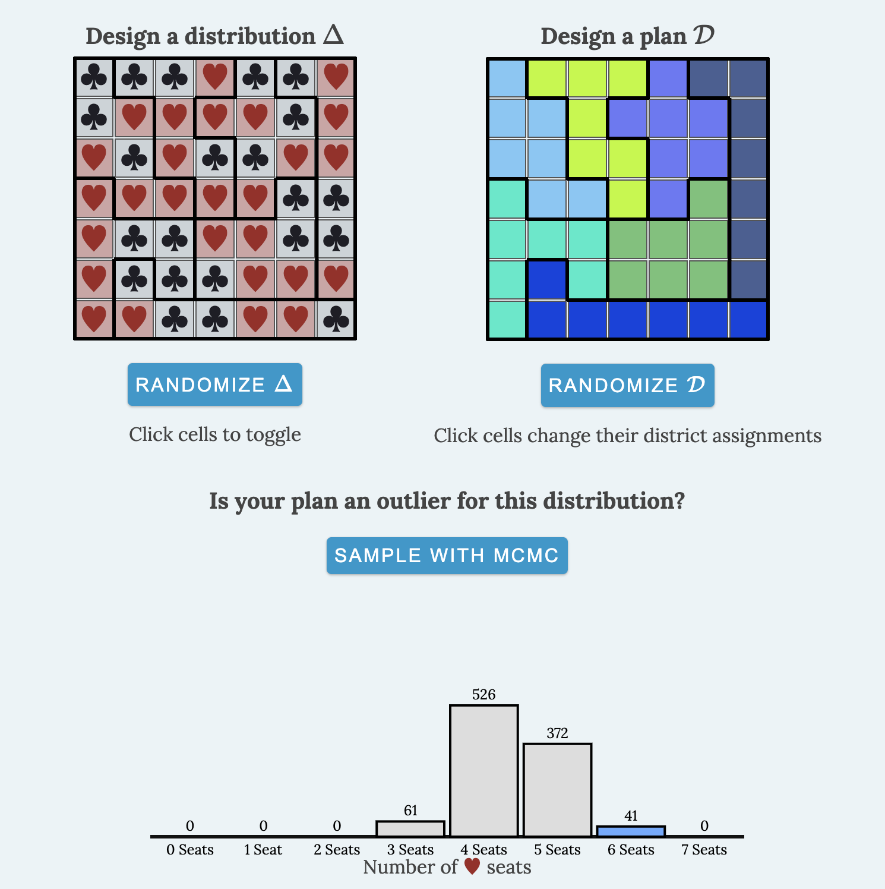

<!-- `pandoc --pdf-engine=pdflatex -o gridtopia.pdf gridtopia.md` -->

# Gridtopia and Gerrymandering

On the following page, you will see voters (hearts and clubs) in a $7 \times 7$ grid along with a $7 \times 7$ district plan with $7$ districts. (Today's lesson brought to you by the [number seven (sound on!)](https://www.youtube.com/watch?v=h9PNoJuP-mk).)

## Questions

Define $p(D)$ to be the perimeter of a district $D$ and $a(D)$ to be the area of a district $D$.

1. Compute the Polsby-Popper score for each district, $$pp(D) = \frac{4\pi a(D)}{p(D)^2}.$$
2. Compute the Schwarzberger score for each district,  $$s(D) = \frac{c(D)}{p(D)},$$ where $c(D)$ is the circumference of a circle of area $a(D)$.
3. Compute the Convex Hull score for each district, $$ch(D) = \frac{a(D)}{a(MP(D))},$$ where $MP(D)$ is the smallest polygon containing the district $D$.
4. Compute the Reock score for each district, $$r(D) = \frac{a(D)}{a(MC(D))},$$ where $MC(D)$ is the smallest circle containing $D$; the previous exercise might help you figure out the diameter of this circle.
5. Compute each district's $x$- and $y$-symmetry scores, $$xs(D) = \frac{a(f(D)\cap D)}{a(D)},$$ (respectively $ys(D)$) where $a(f(D)\cap D)$ is the area in common between $D$ and a reflection $f(D)$ across the horizontal axis (respectively, vertical axis).
6. Compute the efficiency gap of this district plan, where efficiency gap $eg$ is the difference in the parties' wasted votes divided by the total number of votes.
	- All votes for a losing candidate in a district are wasted.
	- To win a district, 4 votes are needed. Any excess votes for the winner are wasted.
	- For example, if $v_D(\spadesuit) = 2$ and $v_D(\heartsuit) = 5$ in district $D$, $\heartsuit$ won with $w_D(\heartsuit) = 1$ vote and $w_D(\spadesuit) = 2$ votes.
	- Thus, $$eg = \left| \frac{\sum_D w_D(\spadesuit) - \sum_D w_D(\heartsuit)}{49}\right|.$$

## References
- [Gridtopia Game](https://vrdi.github.io/outlier/index.html)
- [Outlier Analysis](https://mggg.org/metagraph/7x7.html)

